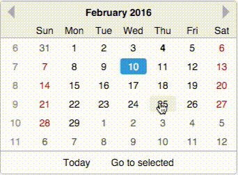
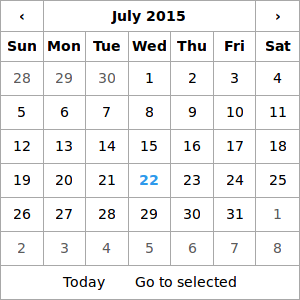
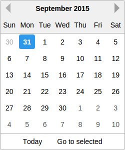

react-date-picker
=================

<!-- [](https://circleci.com/gh/zippyui/react-date-picker/tree/master) -->


> A date picker built especially for React, with love.

[](http://zippyui.github.io/react-date-picker)

[](http://zippyui.github.io/react-date-picker)
[](http://zippyui.github.io/react-date-picker)

Click for [LIVE DEMO!](http://zippyui.github.io/react-date-picker)

## Install

```sh
$ npm install react-date-picker
```

## Usage

Require the css
```jsx

require('react-date-picker/index.css');

var DatePicker = require('react-date-picker');

```

```jsx

var date = '2014-10-10' //or Date.now()

function onChange(dateString, moment){
    //...
}

<DatePicker
    minDate='2014-04-04'
    maxDate='2015-10-10'
    date={date}
    onChange={onChange}
/>
```

## Theming

Theming is done by requiring a specific css file.

By default, `react-date-picker/index.css` contains both structural styles and the default theme.

If you want to load a specific theme, make sure you load
```jsx
require('react-date-picker/base.css')
```
first (which contains only structural css rules), and then any css theme file. For now, there are two themes available:
 
 * `react-date-picker/theme/default.css`
 * `react-date-picker/theme/hackerone.css`

### hackerone theme
 


```jsx
require('react-date-picker/base.css');
require('react-date-picker/theme/hackerone.css');
var DatePicker = require('react-date-picker');

<DatePicker
    minDate='2014-04-04'
    maxDate='2015-10-10'
    date={date}
    onChange={onChange}
/>
```

## Changelog

See [changelog](./CHANGELOG.md)

## Usage

### NOTES:

Don't forget to include index.css or index.styl! ( require('react-date-picker/index.css') )

If you use the files from the `dist` directory, (eg: `dist/react-date-picker.js`), you will need to make sure you have both `React` and `moment` global variables, so make sure you include [ReactJS](https://www.npmjs.com/package/react) and [MomentJS](https://www.npmjs.com/package/moment)

The preferred **React** version for `react-date-picker` is  >=0.12. The initial version of `react-date-picker` worked with React 0.11.2 as well, but I do not intend to continue to support it, in order to be able to focus on advancing the current features and developing other high-quality React components.

## I18n and localization

For rendering the date picker with a custom locale, there are two options

#### require locale

The first option is to simply require the appropriate momentjs locale before `require`-ing `react-date-picker`

Example:

```jsx
//make sure you require this first!
var nl = require('moment/locale/nl')

//and then require the date picker - it will use
//the locale you previously required

var DatePicker = require('react-date-picker')
```

#### locale prop

The second option is specifying the `locale` prop on the date picker. This assumes you have momentjs with the locale already into page (for example, you are using `moment-with-locales.js`)

```jsx
<DatePicker locale="fr" />
```


### Other i18n props

 * `weekDayNames` - either an array of week day names, or a function that returns an array. In case you specify `weekDayNames` as an array, it should have Sunday as the first day. If not specified, will be built with `momentjs`using `moment.weekdaysShort()`
 * `weekStartDay`: Number - Sun 0, Monday 1, etc... If not specified, the locale specific value will be uesd.
 * `locale`: String
 * `todayText`: String
 * `gotoSelectedText`: String

## Props

 * `hideFooter`: Boolean - by default footer is shown, so specify this to true if you don't want the footer
 * `hideHeader`: Boolean - by default header is shown, so specify this to true if you don't want the header
 * `date`    : Date / String / Moment / Number - for controlled behavior. Make sure you also specify an `onChange` prop
 * `range`    : Date / String / Moment / Number - for controlled behaviour make sure you also specify an `onRangeChange` prop
 * `defaultDate`: Date / String / Moment / Number - for uncontrolled behavior
 * `defaultRange`: Date / String / Moment / Number - for uncontrolled behavior
 * `minDate` : Date / String / Moment / Number
 * `maxDate` : Date / String / Moment / Number
 * `dateFormat`: String [see moment.js formats](http://momentjs.com/docs/#/displaying/format/). Default date format is 'YYYY-MM-DD'
 * `onChange`: Function (dateText, moment, event) - called when the user selects a date
 * `onRangechange`: Function (arrayText, arratMoment, event) - called when the user selects a range

 * `onSelect`: Function(dateText, moment, view) - called when the user selects a year/month
 * `onNav`: Function(dateText, moment, view, direction) - called when the user navigates to the next/previous month/year/decade.
 * `renderDay`: Function - (optional) A function that should return a React DOM for the day cell. The first param is the props object. You can use this to have full control over what gets rendered for a day.
 * `onRenderDay`: Function - (optional) A function that can manipulate the props object for a day, and SHOULD return a new props object. Use this for custom day styling. You can use this to take full control over the styles/css classes/attributes applied to the day cell in the month view.
 * `views`: Object - an object that maps view names to factory functions. See the exported `DatePicker.views`
 * `weekNumbers`: Boolean (default false) - Shows weeknumbers - it's locale aware.
 * `weekNumberName`: String / ReactElement (defaults to '') - What to render in the view header cell, above all week numbers.
 * `renderWeekNumber`: Function - A function to render week number. Has the same behavior as `renderDay`.
 * `onWeekChange`: Function(weekDates, event) - When a week is clicked you get an array of the dates in that week
 * `highlightRangeOnMouseMove` : Boolean (default true) - when hover mouse over a date, shows the range that will be selected if the date is clicked

#### Formatting props

 * `dayFormat` - The format in which days should be rendered (on the MonthView)
 * `monthFormat` - The format in which months should be rendered (on the YearView)
 * `yearFormat` - The format in which years should be rendered (on the DecadeView)

#### Props related to the view (the current date in view and the type of view)
 * `defaultViewDate`: Date / String / Moment / Number - a date for the period to show in the picker. If none specified, defaults to `date` or to the current date.
 * `viewDate`: Date / String / Moment / Number - controlled version for `defaultViewDate`
 * `onViewDateChange`: Function(dateText, moment , view) - called when navigating to another viewDate.

 * `defaultView`: String - the view to render initially in the datepicker - if no defaultView is specified, the "month" view is rendered. Possible values: "month", "year", "decade".
 * `view`: String - controlled version for `defaultView`.
 * `onViewChange`: Function - function called when the view is changed. If using the controlled `view` version, make sure you update the `view` prop in this function if you want to navigate to another view as expected.

 * `navOnDateClick`: Boolean - defaults to true. If false, will not navigate to the date that was clicked, even if that date is in the prev/next month
 * `alwaysShowPrevWeek` Boolean - defaults to false. If false, when the month starts on the first day of the week (`weekStartDay`), no days from the previous month will be displayed. Otherwise the first row will display the last week from the previous month. 

## Other props

 * `highlightWeekends`: Boolean - defaults to false. By default, weekend days have the `'dp-weekend'` className, but this will also add the `'dp-weekend-hightlight'` className with a default redish color.

## Styling with css

In order to change the date-picker border width/color with css, you'll have to specify a different border for the `.date-picker` and `.date-picker .dp-cell` classes.
You'll also probably want `.dp-cell:first-child` left border to be 0 and `.dp-cell:last-child` right border to be 0

```css
.date-picker,
.date-picker .dp-cell {
    border: 1px solid red;
}
.date-picker .dp-cell:first-child {
    border-left: 0px;
}
.date-picker .dp-cell:last-child {
    border-right: 0px;
}
```


#### Custom styling of day cells

```jsx

function onRenderDay(props){
    if (props.date.isBefore('2010-01-01')){
        props.className += ' invalid'
    }

    props.style.border = '1px solid red'

    return props
}

<DatePicker
    onChange={this.onChange}
    onRenderDay={onRenderDay}
/>
```
## Contributing

When contributing, please work on the `src` dir.

You'll need to run the following commands:

```sh
$ npm run dev
# starts webpack-dev-server, which does all the bundling and live reloading
```

Now navigate to [localhost:8080](http://localhost:8080)
With this setup, you have an environment which live-reloads all your changes, so you have a rapid development cycle.

In order to build a new production version, make sure you run `npm run build` (it builds the `lib` directory from the `src` directory, it concats all files and builds the `dist` directory, and also prepares the css files)

## Other

`react-date-picker` uses the awesome `moment.js` library ( Big thanks!)

If you don't use npm you can include any of the following:

 * `dist/react-date-picker.js` - the full sources. NOTE: You'll need to include `React` separately
 * `dist/react-date-picker.min.js` - minified & optimized version. NOTE: You'll need to include `React` separately
 * `dist/react-date-picker.nomoment.js` - the full sources. NOTE: You'll need to include `React` AND `moment.js` separately
 * `dist/react-date-picker.nomoment.min.js` - minified & optimized version. NOTE: You'll need to include `React` AND `moment.js` separately

## Tests

For testing, it is required that you have [io.js](https://iojs.org/) installed. The tests rely on https://www.npmjs.com/package/jsdom for a DOM implementation, which only works in `io.js` and not `node.js`

Before running tests, make sure you refresh the `lib` folder, which is built from the `src` folder (jsx is transpiled to normal js) by doing
```sh
$ npm run lib
```

Now you can safely run tests with
```sh
$ npm test
```
or
```sh
$ make
```

For watch mode, run
```sh
$ make test-w
```

`react-date-picker` is setup with `CircleCI` https://circleci.com/gh/zippyui/react-date-picker so every time a test fails we are notified on the failure.
## License

#### MIT
