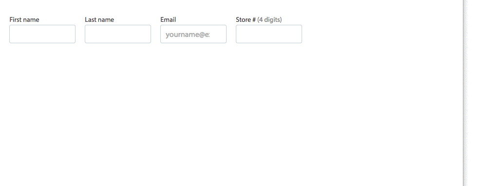

# layout

The components in this library are responsive layout helpers. You are probably looking for either `Layout` or `MediaSelector`.

> Before getting started, please make sure you read the [React Developer Guide](https://gecgithub01.walmart.com/react/react-dev-guide)!

# The Layout Component

`Layout` makes it easy to specify a number of columns in a given size. For example, this code:

```
<Layout medium={4} large={6} padded={true}>
  <FirstNameField />
  <LastNameField />
  <EmailField />
  <StoreNumberField />
</Layout>
```

Says that in the medium media size we want four columns, while in large we want six. Layout defaults to a single column layout for small size. Below is a preview of what this looks like in the brower:



The supported numbers of columns are: 1, 2, 3, 4, 6, and 12.

You can also specify column widths individually using the `-sizes` properties. For example, this code:

```
<Layout medium-sizes={[3,3,4,2]} large={6} padded={true}>
  <FirstNameField />
  <LastNameField />
  <EmailField />
  <StoreNumberField />
</Layout>
```

Says that in medium the column widths should be 3, 3, 4 and then 2, as you can see in the preview below:


Layout uses the 12 column grid layout.

# The MediaSelector Component

`MediaSelector` gives you the ability to select sub-components to show and hide based on the current media width. For example:

```
<MediaSelector>
  <div visibleWidths={['small']}>
    <Heading.H1>Kitten In Small</Heading.H1>
    
  </div>
  <div visibleWidths={['medium']}>
    <Heading.H1>Puppy In Medium</Heading.H1>
    
  </div>
</MediaSelector>
```

This code shows a puppy in medium size and a kitten in small size:


## Installation

```
npm install @walmart/wmreact-layout
```

## Styles

Layout uses [lithe](https://gecgithub01.walmart.com/electrode/lithe) for certain styles. For layout to work correctly, a consuming app must require tenant specific `variables.styl` from lithe e.g. (walmart)[https://gecgithub01.walmart.com/electrode/lithe/blob/master/packages/lithe-extras/lib/tenants/walmart/variables.styl].

```
@import "~@walmart/lithe-extras/lib/tenants/walmart/variables.styl";

@import "~@walmart/wmreact-layout/styles/layout";
```

## Scripts


If you want to use `builder` as a CLI tool (recommended), follow the instructions at [formidablelabs/builder to modify your `PATH`](https://github.com/formidablelabs/builder#local-install)

Anywhere you see `builder run`, if you do not use the builder cli, you can use `npm run` instead.

To run the demo:

```
builder run demo
```

To view the demo, navigate to `http://localhost:4000`

To view the demo with hot reload enabled, navigate to `http://localhost:4000/webpack-dev-server/`

To run tests:

```
builder run test
```

To build /lib:

```
builder run build
```

##npm link

When using npm link, you must delete react from `zeus-components-layout/node_modules/`. This is because npm link is just a symlink, not a proper `npm install`.

You must also run `builder run build`
## Issues

Before submitting an issue, please see the [Issue Submission Guidelines](https://gecgithub01.walmart.com/react/react-dev-guide#submitting-issues)

## Contributing

If you're interested in contributing, see the [React Developer Guide's Contribution Guide](https://gecgithub01.walmart.com/react/react-dev-guide#contributing)
