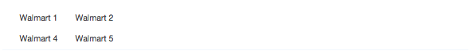

# The Table Component

> Before getting started, please make sure you read the [React Developer Guide](https://gecgithub01.walmart.com/react/react-dev-guide)!

`Table` gives you the ability to arrange your data just the way you like it. For example:

```
  <Table>
    <Table.Head alt={true}>
      <Table.Header>Header 1</Table.Header>
      <Table.Header colSpan={3}>Header 2</Table.Header>
    </Table.Head>
    <Table.Body>
      <Table.Row>
        <Table.Cell>Walmart 1</Table.Cell>
        <Table.Cell>Walmart 2</Table.Cell>
        <Table.Cell>Walmart 3</Table.Cell>
        <Table.Cell>Walmart 4</Table.Cell>
      </Table.Row>
      <Table.Row>
        <Table.Cell>Walmart 5</Table.Cell>
        <Table.Cell>Walmart 6</Table.Cell>
        <Table.Cell>Walmart 7</Table.Cell>
        <Table.Cell>Walmart 8</Table.Cell>
      </Table.Row>
    </Table.Body>
  </Table>
```

This code shows a standard table with a header:


# Column Groups

The 'table' component comes fit with the ability to create column groups, so it is easy to
add a class across a series of columns. To do so you just need to supply the table's
`colGroupClasses` prop with an array of classes. Each position in the array will correlate to
a column in the table. Like so:

```
  <Table colGroupClasses={["table-size-fit", "table-size-fill"]}>
    <Table.Body>
      <Table.Row>
        <Table.Cell>Walmart 1</Table.Cell>
        <Table.Cell>Walmart 2</Table.Cell>
      </Table.Row>
      <Table.Row>
        <Table.Cell>Walmart 4</Table.Cell>
        <Table.Cell>Walmart 5</Table.Cell>
      </Table.Row>
    </Table.Body>
  </Table>
```

this will render into a table with the first column following the styling of `table-size-fit` and
the second column following the styling of `table-size-fill`. Below is the result of the code above:



## Installation

```
npm install @walmart/wmreact-table
```


## Scripts

If you want to use `builder` as a CLI tool (recommended), follow the instructions at [formidablelabs/builder to modify your `PATH`](https://github.com/formidablelabs/builder#local-install)

To run the demo:

```
builder run demo
```

To view the demo, navigate to `http://localhost:4000`

To view the demo with hot reload enabled, navigate to `http://localhost:4000/webpack-dev-server/`

To run tests:

```
builder run test
```

To build /lib:

```
builder run build
```

##npm link

When using npm link, you must delete react from `zeus-components-layout/node_modules/`. This is because npm link is just a symlink, not a proper `npm install`.

You must also run `builder run build`

## Issues

Before submitting an issue, please see the [Issue Submission Guidelines](https://gecgithub01.walmart.com/react/react-dev-guide#submitting-issues)

## Contributing

If you're interested in contributing, see the [React Developer Guide's Contribution Guide](https://gecgithub01.walmart.com/react/react-dev-guide#contributing)
