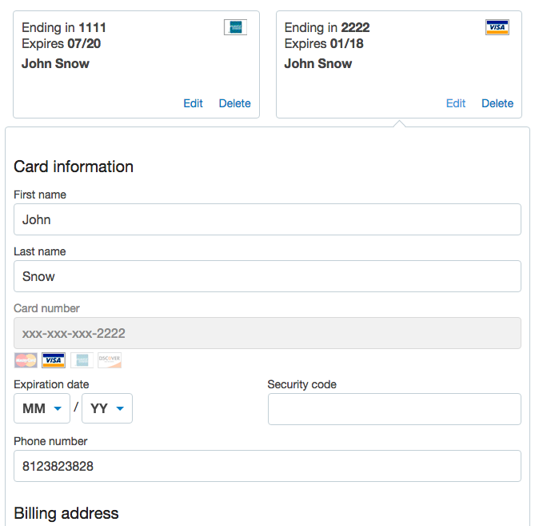

# header
> Before getting started, please make sure you read the [React Developer Guide](https://gecgithub01.walmart.com/react/react-dev-guide)!

Credit card react components. For a drop-in experience using redux, check out [`redux/credit-card`](https://gecgithub01.walmart.com/redux/credit-card)

# Usage
## Installation

```
npm install @walmart/wmreact-credit-card
```

## What it looks like



## How To Use It

Credit cards is a set of dumb components representing the layout of the users credit cards and a single credit card tile.
For examples 

## Scripts

If you want to use `builder` as a CLI tool (recommended), follow the instructions at [formidablelabs/builder to modify your `PATH`](https://github.com/formidablelabs/builder#local-install)

To run the demo:

```
builder run demo
```

To view the demo, navigate to `http://localhost:4000`

To view the demo with hot reload enabled, navigate to `http://localhost:4000/webpack-dev-server/`

To run tests:

```
builder run test
```

To build /lib:

```
builder run build
```

##npm link

When using npm link, you must delete react from `zeus-components-layout/node_modules/`. This is because npm link is just a symlink, not a proper `npm install`.

You must also run `builder run build`

## Issues

Before submitting an issue, please see the [Issue Submission Guidelines](https://gecgithub01.walmart.com/react/react-dev-guide#submitting-issues)

## Contributing

If you're interested in contributing, see the [React Developer Guide's Contribution Guide](https://gecgithub01.walmart.com/react/react-dev-guide#contributing)
