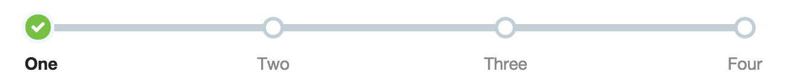
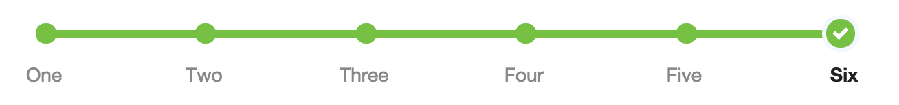
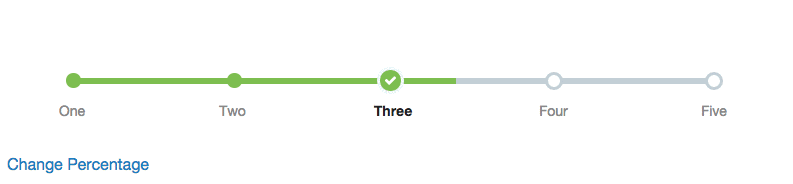

# Infograph

This component implements to Inforgraph.

# Examples

Here is a graph with five points, where up to the second is completed:

```
<Infograph
  labels={["One", "Two", "Three", "Four", "Five"]}
  completed={2} />
```

It looks like so:


A four point graph:

```
<Infograph
  labels={["One", "Two", "Three", "Four"]}
  completed={1} />
```

It looks like so:



And a six point graph:

```
<Infograph
  labels={["One", "Two", "Three", "Four", "Five", "Six"]}
  completed={6} />
```

And so:



Currently the stylesheets only support between four and six graph points:

If you use the `completedPercent` prop to set the current completion by percent, and you change it, then you will get an animated effect:



## Installation

```
npm install @walmart/wmreact-table
```


## Scripts

If you want to use `builder` as a CLI tool (recommended), follow the instructions at [formidablelabs/builder to modify your `PATH`](https://github.com/formidablelabs/builder#local-install)

To run the demo:

```
builder run demo
```

To view the demo, navigate to `http://localhost:4000`

To view the demo with hot reload enabled, navigate to `http://localhost:4000/webpack-dev-server/`

To run tests:

```
builder run test
```

To build /lib:

```
builder run build
```

##npm link

When using npm link, you must delete react from `zeus-components-layout/node_modules/`. This is because npm link is just a symlink, not a proper `npm install`.

You must also run `builder run build`

## Issues

Before submitting an issue, please see the [Issue Submission Guidelines](https://gecgithub01.walmart.com/react/react-dev-guide#submitting-issues)

## Contributing

If you're interested in contributing, see the [React Developer Guide's Contribution Guide](https://gecgithub01.walmart.com/react/react-dev-guide#contributing)
